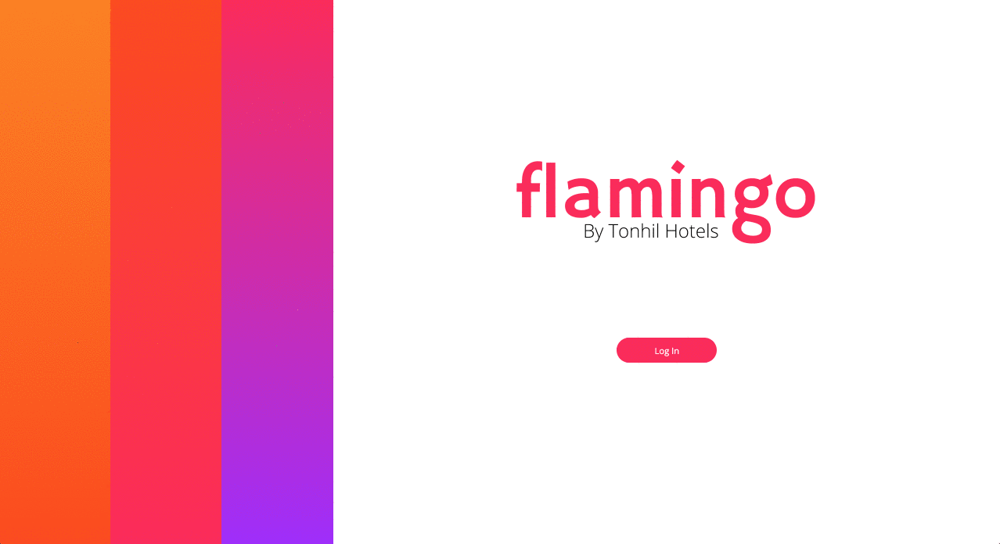
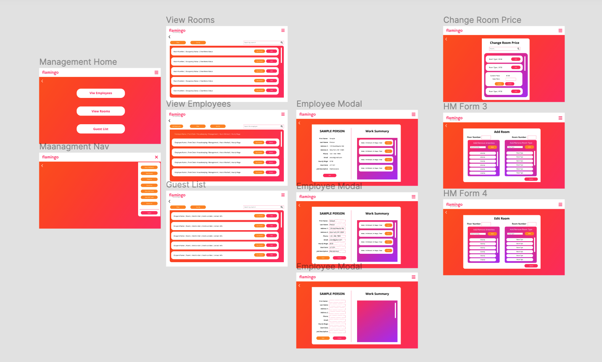
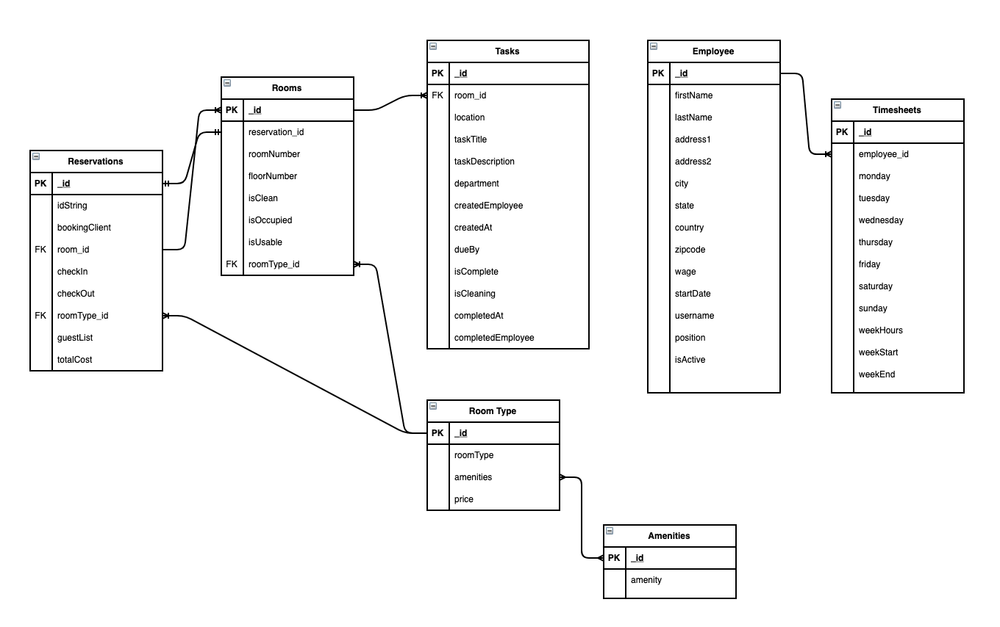

# [FlaminGo](https://flamingo.colinchauche.com)

## Hotel Management Software

This proof of concept app was built in 8 days by a team of 11 developers while at Hack Reactor. The client wanted an intuitive and simple app to manage the core functions of a hotel. Additionally they wanted it to have a design that emphasized the colors of the tropics where his hotel is located. Using the MERN stack we were able to build a functioning prototype that addressed all the core functionality the client asked.  Details about the scope of the project can be found in the proposal we submitted to the client [HERE](https://docs.google.com/document/d/1up5KkerC1LNrYWq7IBTEqzn4n7kVMJXNr4_95pcGyLA/edit?usp=sharing)

---

## Personal Contributions
For this project my main contributions where: 
- ER Diagram and Schema Design
- RESTful API Design
- Maintained API Documentation
- Built the 'Reservations' Routes
- Dockerized App for Deployment
- Deployed App on AWS EC2
- Set-up Caddy Server (To serve using HTTPS)
---

## Table of Contents
- [Technologies](#Technologies)
- [Figma Mock Up](#figma-mock-up)
- [Entity Relationship Diagram](#entity-relationship-diagram)
- [FlaminGo Backend API Documentation](#flamingo-backend-api-documentation)

## Technologies

### Front-end
  + React
  + Axios
  + Webpack
  + Babel
  + Auth0

### Backend
  + Node.js
  + Express
  + Mongoose
  + MongoDB
  + Cron

### Deployment
  + Docker
  + AWS
  + Caddy

### Test Suite
  + Jest
  + Enzyme

### Style Guide
  + ESLint with AirBNB style guide

## Figma Mock Up

Wireframes for FlaminGo where created using Figma and can be found [HERE](https://www.figma.com/file/wa3xLQvi6io40KakWiF0BE/flamingoStyleGuide?node-id=158%3A573)

## Entity Relationship Diagram
The ER diagram was the place where we started from designing the schemas for the database. In the end the tables in the ER diagram were pretty closely matched to what showed up in our schema. There were some big changes that happened along the way as we began to consider the implications of how reservations would be made, mongoDB made it relatively easy to adapt to those changes. Though in retrospect I could have better leveraged mongoDB's ability to nest documents to reduce the complexity of some queries. 

Final versions of each collection's schema for our database can be found in the [schemas](./db/schemas) folder.
## FlaminGo Backend API Documentation

Because of the short time we had to build the app it was essential that both the front end and the back end teams could work simultaneously.  Meaning that we couldn't have a working API for the front end to use in development and similarly we didn't have a finished front end to build for.  The API documentation was my solution to make sure that the front end team could build knowing what data to expect and what endpoints they had available while it also gave the back end team a goal to drive towards. While there were changes along the way this document facilitated those conversations and helped us catch system design issues early. 

The full API Documentation can be found [HERE](./flamingoAPI.md)

_Sample from API Documentation_

_Have a great day!_
